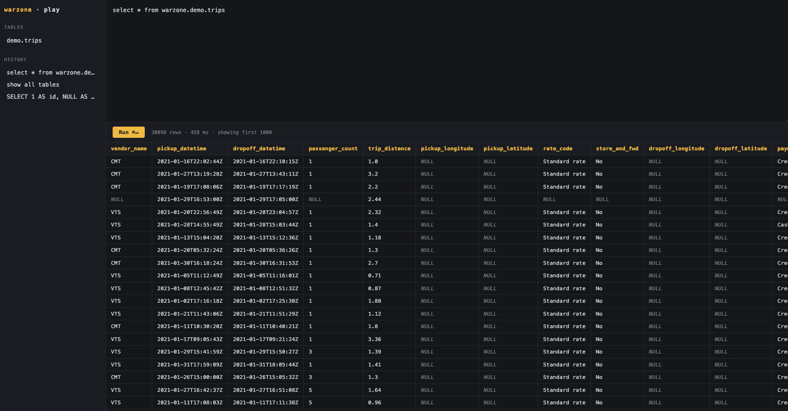

# warzone

> **Status: not ready for production.** Under active early development. APIs, config format, and storage layout may change without notice.

A PostgreSQL-compatible database that stores data natively as Apache Iceberg tables on Parquet. Goal: give developers a full database experience (SQL, transactions, wire protocol) while every byte lands in an open, engine-agnostic format — no separate catalog, compaction, or scheduling infrastructure to stand up.

## Quickstart

Prereqs: Rust stable (`cargo`) and Docker (only for the Tier 2 stack below).

Zero-infra run — Iceberg/Parquet on the local filesystem, no Docker:

```sh
make run   # serves HTTP on :3886 and the Postgres wire protocol on :5432
```

In another terminal, insert a row, read it back, and query it over the
Postgres wire protocol:

```sh
# insert
curl -s -X POST localhost:3886/api/v1/insert \
  -H 'content-type: application/json' \
  -d '{"namespace":"demo","table":"events","data":{"id":1,"name":"hello"}}'

# query (Tier 1 reads the parquet directly — see note below)
curl -s -X POST localhost:3886/api/v1/query \
  -H 'content-type: application/json' \
  -d '{"sql":"SELECT * FROM read_parquet('\''dev/data/warehouse/demo/events/data/*.parquet'\'')"}'

# same query over the Postgres wire protocol
psql -h 127.0.0.1 -p 5432 -c \
  "SELECT * FROM read_parquet('dev/data/warehouse/demo/events/data/*.parquet')"
```

Data lands under `dev/data/warehouse/` as real Iceberg tables + Parquet.
Tier 1 uses an in-memory catalog, so tables aren't registered by name —
read them via `read_parquet(...)`.

For catalog-qualified SQL (`SELECT * FROM warzone.demo.events`) against a real
REST catalog + S3, use the Tier 2 stack — Apache Polaris + SeaweedFS in Docker:

```sh
make dev-up      # start Polaris + SeaweedFS, create the bucket and catalog
make run-stack   # run warzone against dev/stack.yaml
make dev-down    # stop the stack and delete its volumes
```

Full guide and config reference: [docs/development.md](docs/development.md).

## Playground

The server ships a browser SQL playground at
[localhost:3886/play](http://localhost:3886/play) — table list, query history,
and results grid.

To try it against real data, leave the server running and, in another terminal,
load the dummy NYC-taxi dataset into `demo.trips` over the Postgres wire
protocol:

```sh
make load-dummy
```



## Make targets

Run `make help` to list these from the Makefile itself.

| Target | What it does |
| --- | --- |
| `build` | `cargo build --workspace` |
| `test` | Run all tests (infra-free) |
| `fmt` | `cargo fmt --all` |
| `lint` | Clippy, warnings as errors |
| `run` | Tier 1: run against the zero-infra local config (`dev/local.yaml`) |
| `dev-up` | Tier 2: start the Polaris + SeaweedFS stack (bucket + catalog created) |
| `dev-down` | Tier 2: stop the stack and delete its volumes |
| `run-stack` | Tier 2: run against the REST-catalog/S3 stack (needs `dev-up` first) |
| `clean` | Remove Tier 1 local data (`dev/data/`) |
| `load-dummy` | Ingest the dummy NYC-taxi dataset via `dev/scripts/ingestion` |

## Why

Iceberg is becoming the standard open table format for lakehouses, but using it today means assembling and running your own catalog, query engine, object storage, compaction jobs, metadata cleanup, and orchestration. This project packages that stack behind a single database process, the same way PostgreSQL packages a storage engine and transaction manager behind a single process.

## Planned capabilities

- SQL query execution
- Native Iceberg table management
- Automatic metadata generation
- Background file compaction
- Snapshot lifecycle management
- Schema evolution
- Transaction management
- PostgreSQL wire protocol compatibility
- Local dev via a single container; production on S3 / GCS / Azure Blob Storage

## Design principles

- **Open by default** — data stored as standard Iceberg tables and Parquet files, readable by any Iceberg-compatible engine.
- **Zero operational overhead** — no Spark cluster, scheduler, or standalone catalog service needed for common setups.
- **Developer-first** — install and run should feel as simple as PostgreSQL.
- **Scale naturally** — same programming model from a laptop up to cloud object storage.

## Project layout

Rust workspace (`Cargo.toml`), built on `axum` + `tokio`.

- [`src/`](src/) — binary entrypoint, config loading, HTTP server wiring
- [`crates/silo`](crates/silo/) — Iceberg/Parquet backend: catalog, storage, ingest, destination handling
- [`crates/errors`](crates/errors/) — shared error types
- [`docs/`](docs/) — project documentation

## Contributing

See [`docs/contributing`](docs/contributing/).

## License

See [`LICENSE`](LICENSE).
